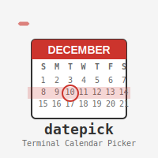

# Datepick - Interactive Terminal Date Picker

[](https://badge.fury.io/rb/datepick)
[](https://www.ruby-lang.org/)
[](https://unlicense.org/)
[](https://github.com/isene/datepick/stargazers)
[](https://isene.org)

 A powerful, interactive terminal date picker built with Ruby and rcurses. Features vim-style navigation, configurable date formats, multiple month views, and extensive keyboard shortcuts. Perfect for shell scripts and command-line workflows that need date selection.

## Features

- **Interactive calendar display** with multiple months
- **Vim-style navigation** with hjkl keys and numeric prefixes
- **Configurable date output formats** with quick presets
- **Customizable multi-month view** (months before/after current)
- **Week start preference** (Monday or Sunday)
- **Visual highlights** for today, selected date, and weekends
- **Flicker-free rendering** using rcurses
- **Persistent configuration** saved to `~/.datepick`

## Installation

Install from RubyGems:

```bash
gem install datepick
```

## Usage

Simply run `datepick` in your terminal:

```bash
datepick
```

The selected date will be printed to stdout when you press Enter, making it perfect for shell scripts:

```bash
# Capture selected date in a variable
selected_date=$(datepick)
echo "You selected: $selected_date"

# Use in file operations
cp important_file.txt "backup_$(datepick).txt"
```

## Keyboard Navigation

### Basic Movement
- **Arrow keys** or **hjkl** - Navigate between dates
- **Enter** - Select current date and exit
- **q** - Quit without selecting

### Advanced Navigation
- **n/p** - Next/Previous month
- **N/P** - Next/Previous year
- **t** - Jump to today
- **H/^** - Go to start of week
- **L/$** - Go to end of week
- **Home** - Go to start of month
- **End** - Go to end of month

### Vim-style Jumps
- **[number]g** - Jump forward by number of days
  - Example: `7g` jumps 7 days ahead
  - Example: `30g` jumps 30 days ahead

### Configuration
- **c** - Enter configuration mode
- **r** - Force refresh display

## Date Format Options

When configuring date format, you can either:

1. **Use quick presets** by entering a number (1-8):
   - `1`: 2025-07-01 (ISO format)
   - `2`: 01/07/2025 (European)
   - `3`: 07/01/2025 (US format)
   - `4`: July 01, 2025 (Long format)
   - `5`: Jul 01, 2025 (Abbreviated)
   - `6`: 20250701 (Compact)
   - `7`: 01-Jul-2025 (DD-Mon-YYYY)
   - `8`: Tuesday, July 01, 2025 (Full with weekday)

2. **Enter custom format** using Ruby's strftime syntax:
   - `%Y-%m-%d` - ISO format (default)
   - `%d/%m/%Y` - European format
   - `%B %d, %Y` - Long format
   - See [Ruby strftime documentation](https://ruby-doc.org/core/Time.html#method-i-strftime) for all options

## Configuration Options

Access configuration by pressing `c`:

- **Date format**: Output format for selected date
- **Months before**: Number of months to show before current month
- **Months after**: Number of months to show after current month  
- **Week starts Monday**: Toggle between Monday/Sunday week start

Configuration is automatically saved to `~/.datepick` and persists between sessions.

## Visual Features

- **Current month**: Bold and underlined month header
- **Today's date**: Highlighted in magenta and bold
- **Selected date**: Yellow background with bold text
- **Weekends**: Red text for Saturday/Sunday
- **Day headers**: Bold with darker colors for better visibility

## Shell Integration Examples

### Bash Scripts
```bash
#!/bin/bash
echo "Select a date for the backup:"
backup_date=$(datepick)
tar -czf "backup_${backup_date}.tar.gz" /important/files/
```

### ZSH Function
```zsh
# Add to your .zshrc
function schedule() {
    local date=$(datepick)
    echo "Scheduled for: $date"
    # Add your scheduling logic here
}
```

### Git Commits with Specific Dates
```bash
# Select a date and create a commit with that date
commit_date=$(datepick)
git commit --date="$commit_date" -m "Your commit message"
```

## Requirements

- Ruby 2.7 or higher
- rcurses gem (automatically installed)
- Terminal with color support

## Development

Clone the repository:
```bash
git clone https://github.com/isene/datepick.git
cd datepick
```

Install dependencies:
```bash
bundle install
```

Run locally:
```bash
ruby -Ilib bin/datepick
```

## Contributing

1. Fork the repository
2. Create your feature branch (`git checkout -b feature/amazing-feature`)
3. Commit your changes (`git commit -m 'Add amazing feature'`)
4. Push to the branch (`git push origin feature/amazing-feature`)
5. Open a Pull Request

## Inspiration

Inspired by [pickdate](https://github.com/maraloon/pickdate) and designed to integrate seamlessly with terminal workflows.

## License

This project is released under the Unlicense - see the project repository for details.

## Author

Created by [Geir Isene](https://isene.com/)

## Links

- **Homepage**: https://isene.com/
- **Source Code**: https://github.com/isene/datepick
- **RubyGems**: https://rubygems.org/gems/datepick
